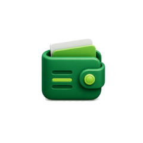

# Solo Ledger

<p align="center">
  
</p>

<h3 align="center">Your personal finance, beautifully tracked.</h3>

<p align="center">
  <a href="https://github.com/mkr-infinity/Solo-Ledger/actions/workflows/build-debug.yml">
    
  </a>
  
  
  
</p>

Solo Ledger is a clean, modern, and fully offline personal finance tracker for Android. Built with Jetpack Compose and Material 3, it helps you take control of your income, expenses, and savings — with beautiful charts, 8 themes, and 7 navigation styles to match your style. No ads, no cloud sync, no accounts. Just you and your money.

---

## Features

- **Transaction Tracking** — Log income and expenses with categories, notes, and dates
- **Dashboard Overview** — See your balance, total income, and total expenses at a glance
- **Beautiful Charts** — Visualize spending trends and category breakdowns with Vico charts
- **Category Management** — Create, edit, and delete custom categories with icons and colors
- **Budgets** — Set monthly budgets per category and track progress in real time
- **Recurring Transactions** — Define repeating income or expenses (daily, weekly, monthly)
- **Search & Filter** — Quickly find any transaction by keyword, category, or date range
- **CSV Export** — Export your data to CSV for use in spreadsheet apps
- **Data Backup & Restore** — Back up your database locally and restore at any time
- **Fully Offline** — All data stays on your device, no internet required
- **No Ads, No Tracking** — Your financial data is yours alone

---

## Themes

Solo Ledger ships with **8 hand-crafted themes** to match your personal style:

| Theme | Description |
|-------|-------------|
| **Midnight Blue** | Deep navy backgrounds with electric blue accents |
| **Forest Green** | Calming dark greens inspired by nature |
| **Rose Gold** | Warm pinks and gold tones for an elegant look |
| **Slate Gray** | Clean, minimal grays for a professional feel |
| **Amber Glow** | Warm amber and orange for a cozy atmosphere |
| **Arctic White** | Crisp light theme with cool blue accents |
| **Deep Purple** | Rich purples with lavender highlights |
| **Carbon Black** | True AMOLED black with high-contrast accents |

---

## Screenshots

> Screenshots coming soon. Build the app and see it in action!

---

## Tech Stack

| Layer | Technology |
|-------|-----------|
| **UI** | Jetpack Compose + Material3 |
| **Architecture** | MVVM + Clean Architecture |
| **DI** | Hilt |
| **Database** | Room |
| **Preferences** | DataStore |
| **Navigation** | Navigation Compose |
| **Charts** | Vico |
| **Async** | Kotlin Coroutines + Flow |
| **Serialization** | Gson |
| **Language** | Kotlin 2.0 |
| **Min SDK** | API 26 (Android 8.0) |
| **Target SDK** | API 35 (Android 15) |

---

## Building

> **This app is built exclusively using GitHub Actions. Do not build locally.**

### How to get a Debug APK:

1. **Fork** this repository to your GitHub account
2. **Push** any commit to the `main` branch (or trigger manually)
3. Go to the **Actions** tab in your forked repository
4. Click on the latest **Build Debug APK** workflow run
5. Scroll down to **Artifacts** and download **Solo-Ledger-Debug-APK**
6. Transfer the `.apk` to your Android device and install it (enable "Install from unknown sources")

---

## Release APK / Signing

To build a signed release APK, you need to set up a keystore and configure GitHub Secrets.

### Step 1 — Generate a Keystore

```bash
keytool -genkey -v \
  -keystore keystore.jks \
  -alias solo-ledger \
  -keyalg RSA \
  -keysize 2048 \
  -validity 10000
```

### Step 2 — Encode the Keystore to Base64

```bash
base64 -i keystore.jks | tr -d '\n'
```

### Step 3 — Add GitHub Secrets

Go to your repository → **Settings** → **Secrets and variables** → **Actions** → **New repository secret**

| Secret Name | Value |
|-------------|-------|
| `KEYSTORE_BASE64` | Base64-encoded content of `keystore.jks` |
| `KEYSTORE_PASSWORD` | The password you set for the keystore |
| `KEY_ALIAS` | The alias you used (e.g. `solo-ledger`) |
| `KEY_PASSWORD` | The key password (same as keystore password if not set separately) |

### Step 4 — Trigger the Release Build

Go to **Actions** → **Build Release APK** → **Run workflow**

---

## Developer

Made with love by **Mohammad Kaif Raja**

- Website: [mkr-infinity.github.io](https://mkr-infinity.github.io)
- Instagram: [@mkr_infinity](https://instagram.com/mkr_infinity)
- Telegram: [@mkr_infinity](https://t.me/mkr_infinity)
- GitHub: [@mkr-infinity](https://github.com/mkr-infinity)

---

## Support

If you find Solo Ledger useful, consider buying me a coffee!

[](https://buymeacoffee.com/mkr_infinity)

---

## License

```
MIT License

Copyright (c) 2024 Mohammad Kaif Raja

Permission is hereby granted, free of charge, to any person obtaining a copy
of this software and associated documentation files (the "Software"), to deal
in the Software without restriction, including without limitation the rights
to use, copy, modify, merge, publish, distribute, sublicense, and/or sell
copies of the Software, and to permit persons to whom the Software is
furnished to do so, subject to the following conditions:

The above copyright notice and this permission notice shall be included in all
copies or substantial portions of the Software.

THE SOFTWARE IS PROVIDED "AS IS", WITHOUT WARRANTY OF ANY KIND, EXPRESS OR
IMPLIED, INCLUDING BUT NOT LIMITED TO THE WARRANTIES OF MERCHANTABILITY,
FITNESS FOR A PARTICULAR PURPOSE AND NONINFRINGEMENT. IN NO EVENT SHALL THE
AUTHORS OR COPYRIGHT HOLDERS BE LIABLE FOR ANY CLAIM, DAMAGES OR OTHER
LIABILITY, WHETHER IN AN ACTION OF CONTRACT, TORT OR OTHERWISE, ARISING FROM,
OUT OF OR IN CONNECTION WITH THE SOFTWARE OR THE USE OR OTHER DEALINGS IN THE
SOFTWARE.
```
