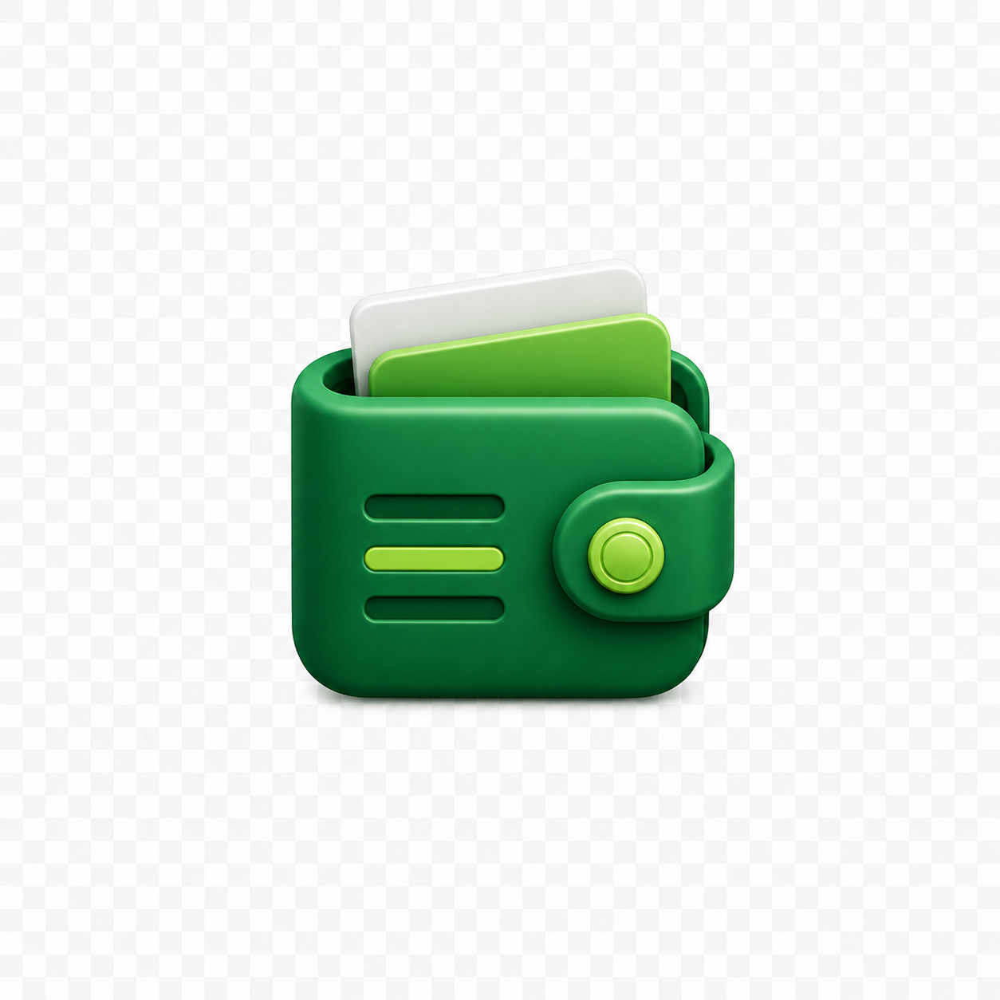

# Solo Ledger

Solo Ledger is a premium offline-first budgeting app for students and young professionals.

## Product Direction

Solo Ledger is built as a Kotlin and Jetpack Compose Android application using MVVM, Navigation Compose, Room, DataStore, Kotlin Coroutines, StateFlow, and Material 3.

The first implementation slice establishes the Android project foundation, app identity, approved theme palette system, and capsule bottom navigation shell. Persistence, expense management, analytics, onboarding, and export features are intentionally handled in later committed slices.

## Design Rules

No emojis are used in the application.

No generic gradients, crypto styling, excessive glow, blue fintech defaults, gold fintech defaults, or placeholder color systems are used.

The visual direction follows premium wallet-style surfaces, strong contrast, short labels, safe icon spacing, and restrained Material 3 motion.

## Themes

The theme scaffold includes:

1. Ledger Light
2. Ledger Dark
3. Emerald Light
4. Emerald Dark
5. Anime Light
6. Anime Dark
7. Spider Light
8. Spider Dark

## Status

Current slice: Savings goals backed by local data.

Implemented foundations:

1. Android Compose project scaffold
2. Theme system and app identity
3. GitHub Actions signed debug APK workflow
4. Room entities, DAOs, database, repositories, and DataStore settings
5. Onboarding flow with budget template selection stored offline
6. Quick Add expense form with local image attachment copy and Room persistence
7. Home dashboard metrics, recent transactions, category breakdown, and monthly graph from saved expenses
8. History screen with search, category filters, sorting, expandable details, and move-to-bin
9. Bin section with restore, delete permanently, and clear all actions
10. Calendar screen with spending-day highlights, date details, and range summaries
11. Savings goal creation, progress additions, archiving, and Home progress cards

Next slice: Settings screen for profile, appearance, dashboard controls, support, and coming-soon cards.
